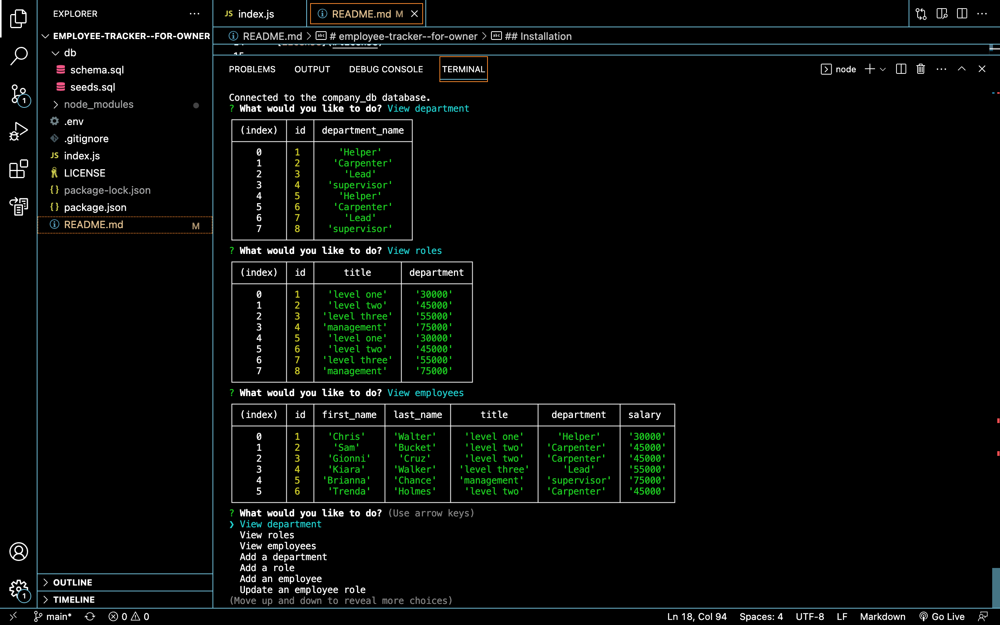

# employee-tracker--for-owner

## Description

I was very motivated to complete this project because i wanted to further my knowledge with creating data bases, using MYSQL, and using work bench. I built this project so and owner and supervisor could keep track, add, and delete employees. This application with also allow you to add departments and roles. This application will help an employor have an more organized platform.

## Table of Contents

- [Installation](#installation)
- [Usage](#usage)
- [Credits](#credits)
- [License](#license)
- [Video](#video)

## Installation

For this application you'll need to install MYSQL2, package.json, node modules, and inquirer.

## Usage

Select what you would like to do by navagating through the prompts to see, add, and delete from tables 

## Credits

## License

MIT License Refer to the repository for more information.

## Video

https://drive.google.com/file/d/1iPUsWiQw5FqlNL7ebkd2wvJXKXCNtUBX/view